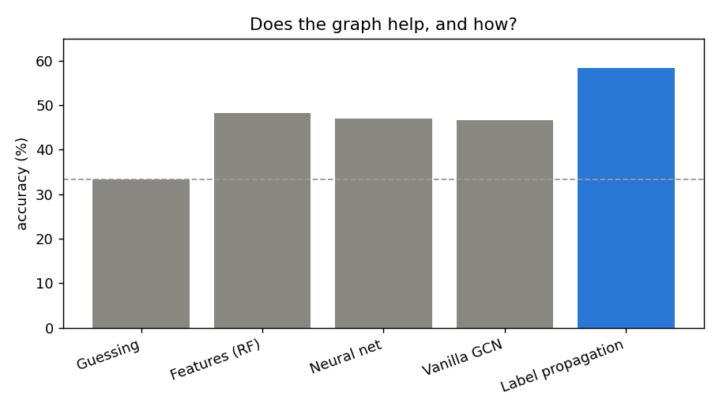
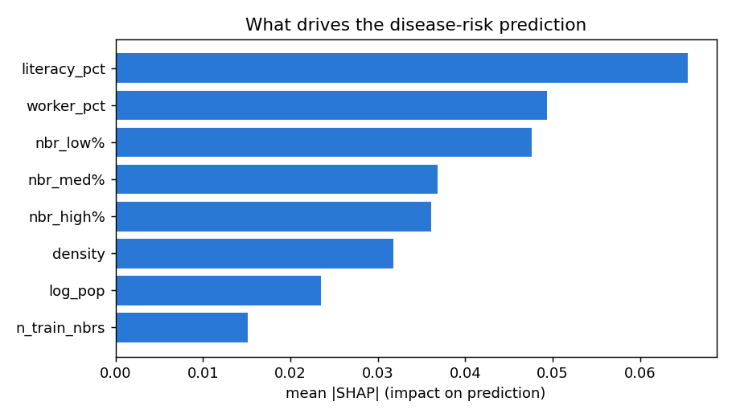

# Explainable graph machine learning for regional disease-risk prediction

## What this is

A small project I built to answer one question: when you are trying to work out
which districts are at high disease risk, does it help to know about a
district's *neighbours*, or is the district's own profile enough? I use COVID-19
across Indian districts as the test case, but the method is meant to be general.

I come from a data-analysis background and wanted to teach myself graph machine
learning on a problem close to public-health surveillance. So the modelling is
deliberately kept simple, and the focus is on running the comparison honestly
and being able to explain the result rather than chasing a high accuracy number.

## The question, more precisely

Each district is a node. Two districts are connected if they share a border.
Each district has a few features from the 2011 Census (population, density,
literacy, share of workers) and a risk tier (low, medium or high) based on its
COVID cases per 100,000 people. The task is to predict the tier. The part I
actually cared about is whether the border connections carry information beyond
the features.

## Data

Three public sources, matched to each other by district name. The name matching
was most of the work, because the three files spell districts differently:

* District boundaries: GeoJSON derived from GADM, used to work out which
  districts border which.
* District features: Census of India, 2011.
* District COVID case counts: the covid19india community archive.

That gives 594 districts and 1,611 border connections. After cleaning up name
mismatches (for example "Cuddapah" vs "Kadapa"), I could attach Census features
to 560 districts and case counts to 545.

## What I did

I compared four approaches on the same train/test split, so the numbers are
comparable:

1. Random Forest on a district's own features only (no graph). The baseline.
2. A small neural network on the same features (no graph).
3. A GCN (graph neural network): same features, but now each district also sees
   its neighbours' features.
4. Label propagation: ignore the features and spread the known risk tiers across
   the border graph.

To keep it honest, the risk tier is never fed back in as an input, and label
propagation only ever uses training-set labels, so nothing leaks from the test
set into the prediction.

## Results

Accuracy on the same 168-district test set:

| Approach | Uses the graph? | Accuracy |
|---|---|---|
| Guessing | no | 33% |
| Features only (Random Forest) | no | 48% |
| Neural net (same features) | no | 47% |
| Vanilla GCN (passes features) | yes, naively | 47% |
| Label propagation (spreads labels) | yes | 58% |



Two things stood out.

First, the GCN did not beat the baseline. Adding the neighbours' features changed
almost nothing.

Second, when I looked into why, the signal turned out to be real but sitting in a
different place than the GCN was looking. Bordering districts share a risk tier
about 46% of the time, against 33% by chance, so risk clearly clusters in space.
And a very simple predictor that just takes the majority tier of a district's
neighbours scores 56%, well above the feature baseline. The catch is that this
signal lives in the neighbours' *labels*, not their Census features. A standard
GCN passes features between neighbours, so it cannot use it. Label propagation
spreads labels, so it can, and it reached 58%.

The lesson I took from this is that with graph methods it is not simply whether
you use the graph, but how. The naive use gave nothing. Using it in the way that
matched where the signal actually lived gave a ten-point jump.

## Explaining the predictions

For the "why", I trained a combined model (a district's features plus a summary
of its neighbours' known risk) and ran SHAP on it.

* Across all districts, the three neighbour-risk features together are the
  largest driver, which matches the result above.
* For a single district it gives a plain reason. For example, Tehri Garhwal is
  flagged high risk mainly because its neighbours are high risk.



That per-district reason is the kind of thing that would matter if this were ever
used to support a real decision, which is why I wanted explainability in here and
not just an accuracy score.

## Honest limitations

* The district COVID data from this period is patchy, and the counts are a
  snapshot, so the risk tiers are rough.
* The area, and therefore the density feature, is approximated from the boundary
  polygons rather than an official figure.
* The accuracies are modest across the board. Demographics on their own are weak
  predictors of disease burden, which is partly the point, but it does mean this
  is a demonstration and not a deployable model.
* "Neighbour" here means shares a border. Disease also travels along roads,
  flights and trade, which a border graph does not capture.

## What I would try next

* Use the case time series to predict a later period from an earlier one, which
  is closer to real forecasting.
* Build a connectivity graph (movement between districts) instead of only shared
  borders.
* Try a graph model that can use neighbour labels directly, not only features.

## How to run

```
pip install -r requirements.txt
python src/download_data.py
python src/build_dataset.py
python src/models.py
python src/explain.py
```
